# DevOps Training Documentation
## Presentation Materials - Day 1 to Day 6

---

## Table of Contents
- [Day 1: DevOps Fundamentals & Ubuntu Server Setup](#day-1-devops-fundamentals--ubuntu-server-setup)
- [Day 2: Network Configuration & Linux Shell](#day-2-network-configuration--linux-shell)
- [Day 3: SSH Configuration & Text Manipulation](#day-3-ssh-configuration--text-manipulation)
- [Day 4: Git & GitHub Basics](#day-4-git--github-basics)
- [Day 5: Application Deployment](#day-5-application-deployment)
- [Day 6: Reverse Proxy with Nginx](#day-6-reverse-proxy-with-nginx)

---

## Day 1: DevOps Fundamentals & Ubuntu Server Setup

### 1. Penjelasan Konsep DevOps

**Apa itu DevOps?**

DevOps adalah praktik yang bertanggung jawab untuk:
- Melakukan deploy aplikasi ke production
- Menangani update aplikasi tanpa harus deploy dari awal (incremental deployment)
- Melakukan testing sebelum deploy untuk menghindari error/downtime
- Monitoring aplikasi secara real-time untuk mendeteksi error
- Memastikan aplikasi berjalan lancar dan stabil

**Key Responsibilities:**
- ✅ Deployment & Updates
- ✅ Testing & Quality Assurance
- ✅ Monitoring & Alerting
- ✅ High Availability

---

### 2. Instalasi Ubuntu Server 22.04.x LTS

**Tools yang Digunakan:** VirtualBox

#### Step-by-Step Installation:

**Step 1: Install VirtualBox**
1. Download VirtualBox dari website resmi
2. Install VirtualBox
3. Reboot/restart komputer
4. Buka VirtualBox

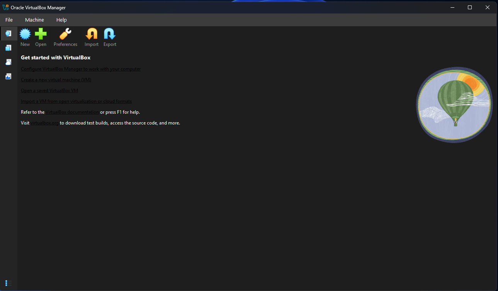

---

**Step 2: Download Ubuntu Server ISO**

Download file ISO Ubuntu Server 22.04.x LTS

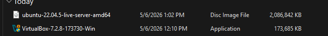

---

**Step 3: Create New Virtual Machine**

1. Klik **New** di VirtualBox
2. Pilih file ISO Ubuntu Server yang sudah didownload

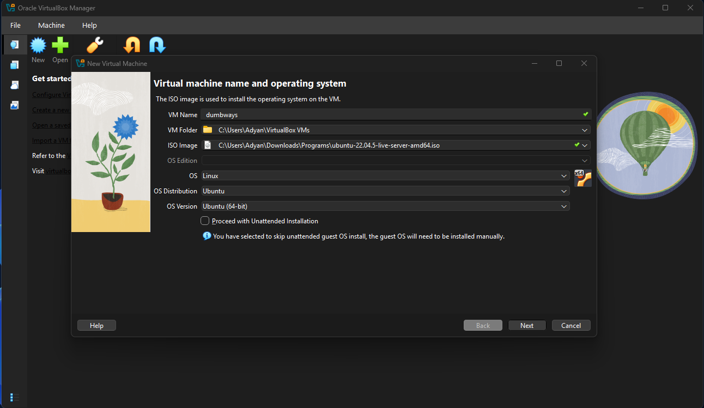

---

**Step 4: Configure VM Resources**

Atur spesifikasi VM:
- **Memory (RAM)**: Sesuai kebutuhan
- **CPU**: Sesuai kebutuhan
- **Disk Size**: Minimal 10GB

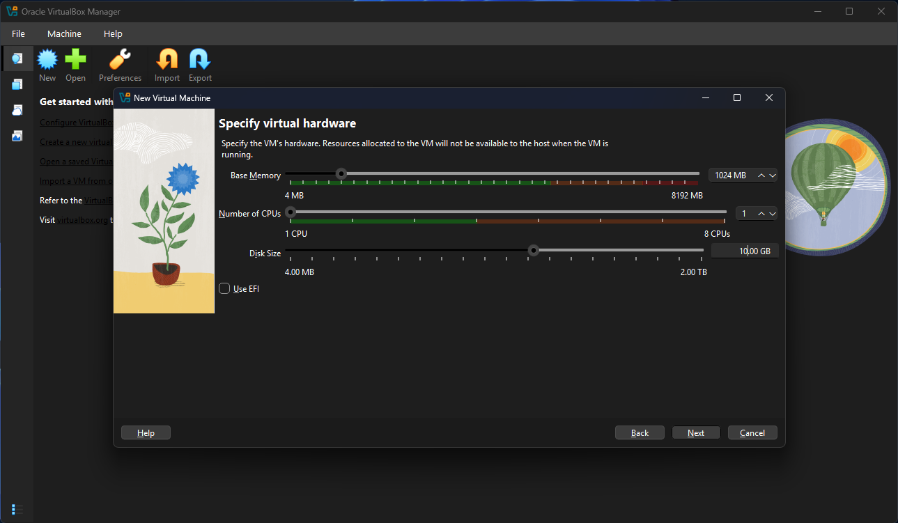

---

**Step 5: Verify Configuration**

Hasil konfigurasi VM:

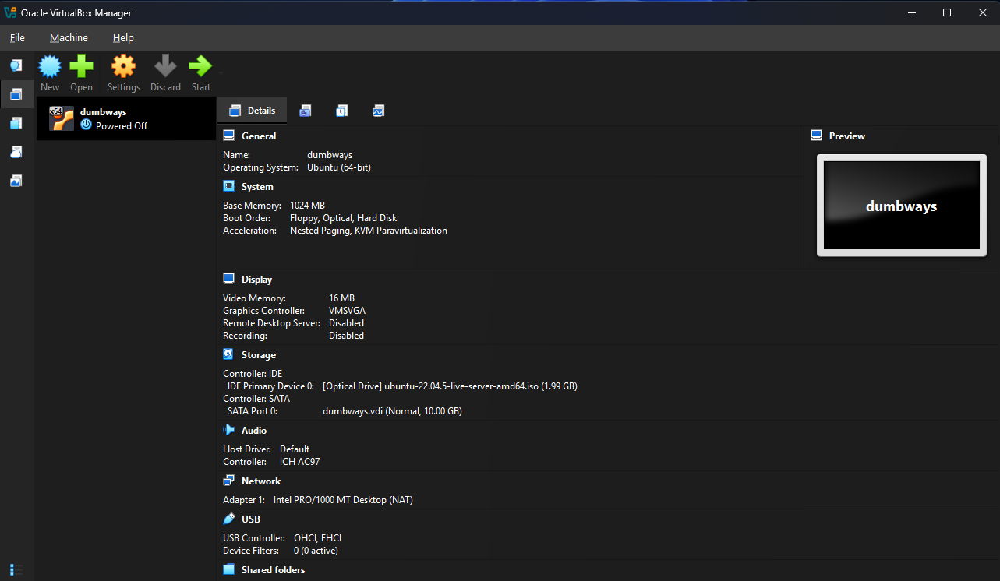

Untuk menjalankan VM, klik **Run**

---

**Step 6: Ubuntu Server Installation Process**

1. **First Boot**: Pilih "Try or Install Ubuntu Server"

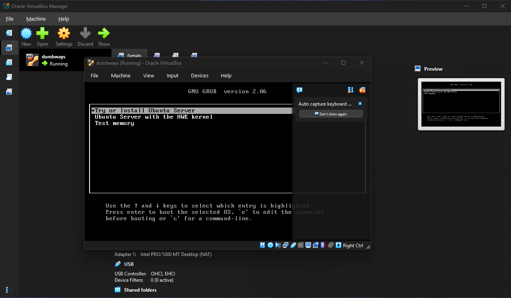

2. **Language Selection**: Pilih English
3. **Update**: Skip update (pilih "Continue without updating")
4. **Keyboard Configuration**: Gunakan default
5. **Installation Type**: Pilih "Ubuntu Server"

---

### 3. Network Configuration - Static IP Address

**Requirement:** Gunakan IP Address `xxx.xxx.xxx.208`

#### Network Setup:

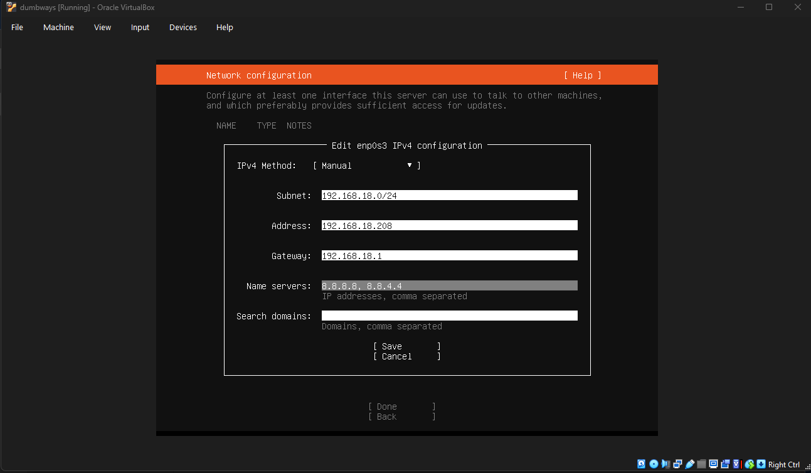

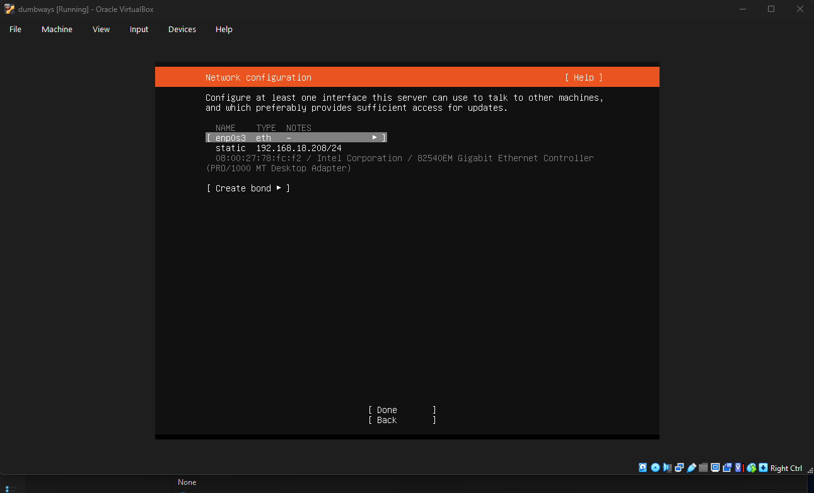

**Configuration Steps:**
1. Skip proxy configuration
2. Skip mirror configuration
3. Configure storage

---

**Step 7: Storage Configuration**

Partisi yang digunakan:
- **Root Partition**: 7GB
- **Swap**: 2GB+

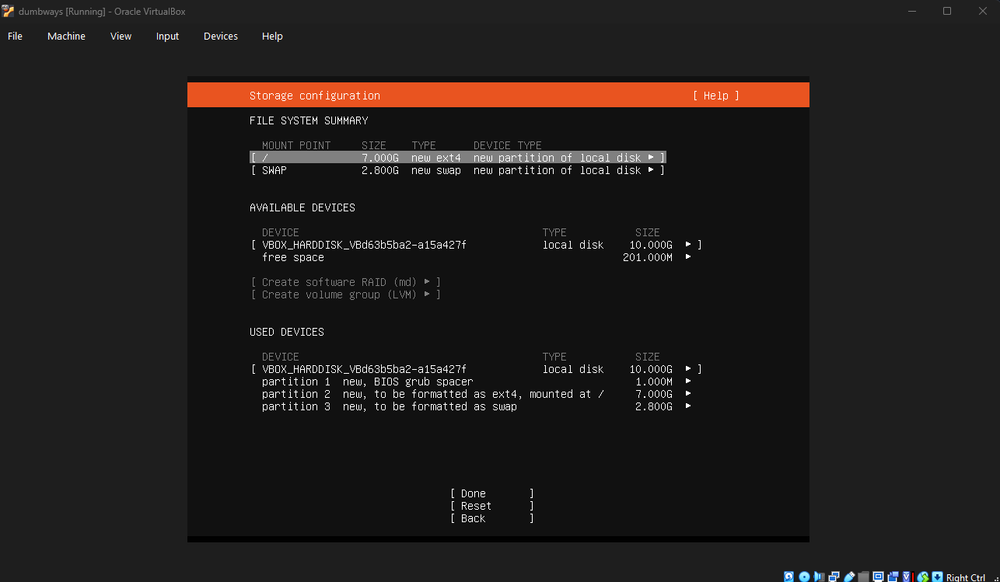

---

**Step 8: Profile Configuration**

Setup user dan hostname:

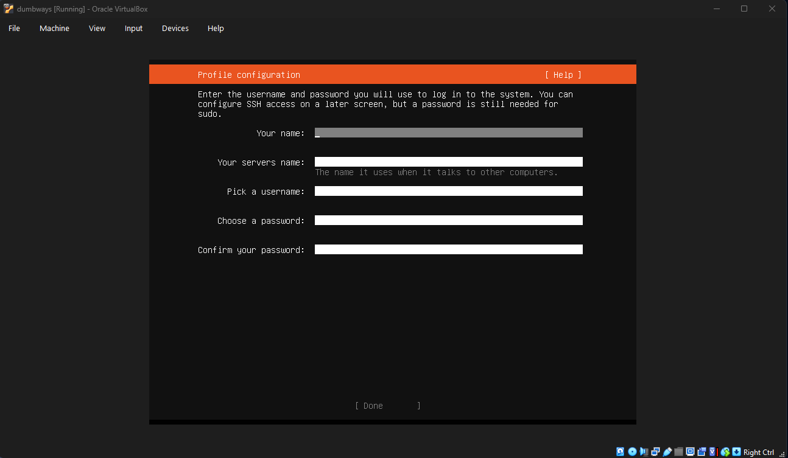

**Additional Steps:**
- Ubuntu Pro: Skip
- SSH Installation: Skip (akan dikonfigurasi nanti)
- Featured Server Snaps: Skip

---

**Step 9: Installation Complete**

Tunggu hingga proses instalasi selesai, lalu klik **Reboot**

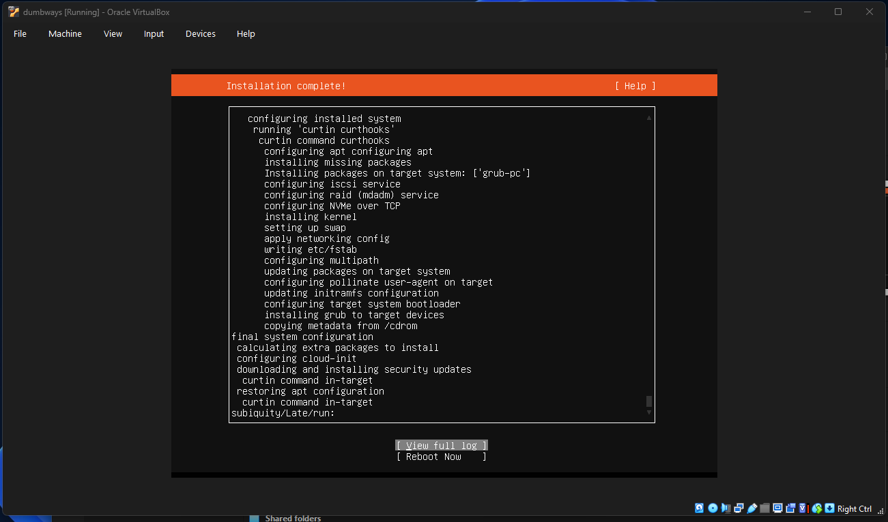

---

**Step 10: First Login**

Login menggunakan credentials yang sudah dibuat:

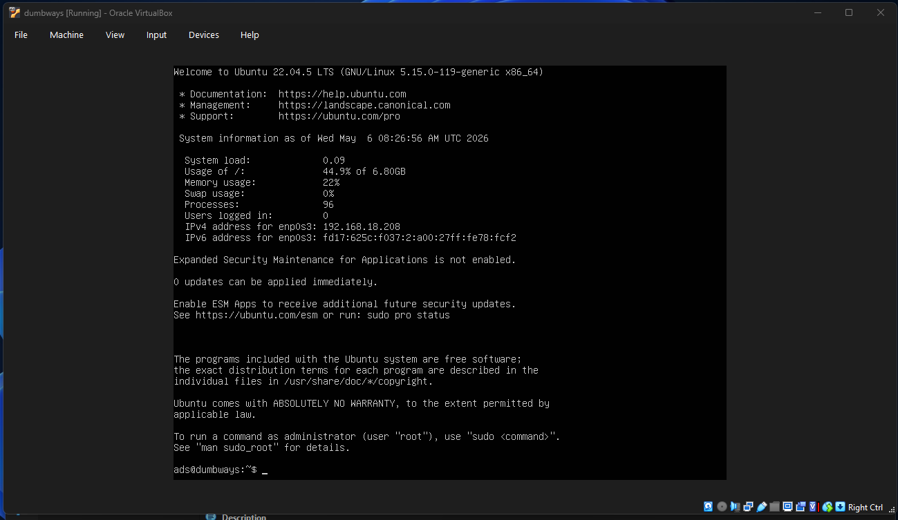

---

### 4. Network Connectivity Test

**Command untuk test koneksi:**

```bash
ping 8.8.8.8
```

atau

```bash
ping google.com
```

**Hasil test ping:**

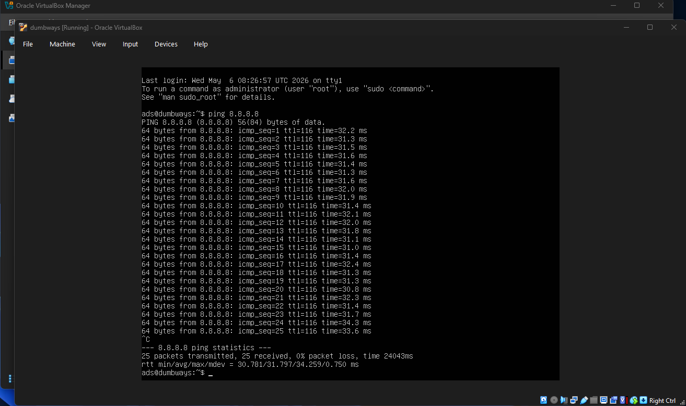

✅ Network connectivity berhasil!

---

## Day 2: Network Configuration & Linux Shell

### 1. Diagram Jaringan Komputer

**Requirement:**
- **IP Class**: C (192.168.4.xxx)
- **CIDR Block**: 192.168.4.0/24
- **Devices**: 4 devices

**Network Diagram:**

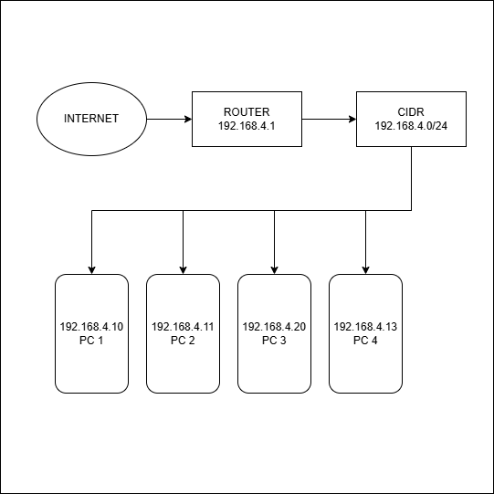

---

### 2. Perbedaan SH vs BASH

| Aspect | SH (Shell) | BASH (Bourne-Again Shell) |
|--------|-----------|---------------------------|
| **Generation** | Shell lama dan basic | Upgrade dari SH |
| **Features** | Fitur minimal, ringan | Fitur lengkap dan modern |
| **Command History** | ❌ Tidak ada | ✅ Ada |
| **Tab Completion** | ❌ Tidak ada | ✅ Ada |
| **Array Variables** | ❌ Terbatas | ✅ Full support |
| **Compatibility** | - | ✅ Backward compatible dengan SH |

**Kesimpulan:**
- **SH**: Basic shell, cocok untuk script sederhana
- **BASH**: Modern shell dengan fitur lengkap, tetap support perintah SH

---

### 3. Dokumentasi Command Linux

#### 📁 Navigation Commands

**`pwd` - Print Working Directory**

Menampilkan posisi direktori saat ini:

```bash
pwd
```

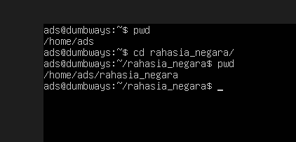

---

**`ls` - List Directory Contents**

Melihat isi direktori:

```bash
ls              # List file biasa
ls -l           # List dengan detail
ls -la          # List semua termasuk hidden file
ls -lh          # List dengan ukuran readable
```

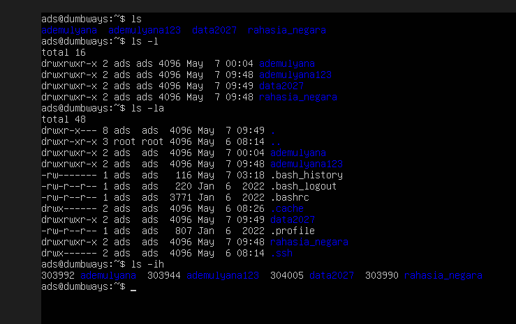

---

**`cd` - Change Directory**

Pindah antar direktori:

```bash
cd /home        # Pindah ke /home
cd ..           # Naik 1 level
cd ~            # Ke home directory
cd -            # Balik ke direktori sebelumnya
```

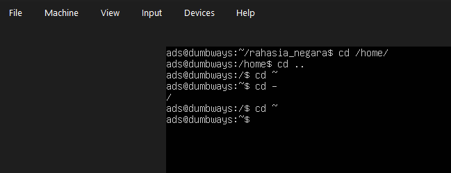

---

#### 📂 Directory Management

**`mkdir` - Make Directory**

Membuat direktori baru:

```bash
mkdir folder1
mkdir -p folder1/folder2/folder3   # Buat nested directories
```

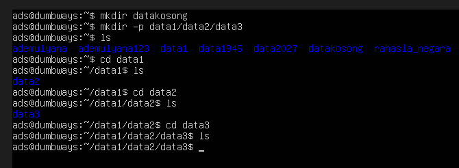

---

**`rmdir` - Remove Directory**

Menghapus direktori kosong:

```bash
rmdir folder1
```

---

#### 📄 File Operations

**`touch` - Create Empty File**

Membuat file baru:

```bash
touch newfile.txt
```

---

**`rm` - Remove Files/Directories**

Menghapus file atau direktori:

```bash
rm file.txt           # Hapus file
rm -r folder1         # Hapus folder dan isinya
rm -rf folder1        # Force delete (hati-hati!)
```

---

**`cp` - Copy Files/Directories**

Copy file atau direktori:

```bash
cp file1.txt file2.txt           # Copy file
cp -r folder1 folder2            # Copy folder
cp file.txt /home/user/          # Copy ke lokasi lain
```

---

**`mv` - Move/Rename Files**

Pindah atau rename file:

```bash
mv file1.txt file2.txt           # Rename file
mv file.txt /home/user/          # Pindah lokasi
```

---

#### 📖 File Viewing & Editing

**`cat` - Concatenate and Display Files**

Menampilkan isi file:

```bash
cat file.txt
cat file1.txt file2.txt          # Gabung beberapa file
```

---

**Text Editors:**

```bash
nano file.txt        # Simple text editor
vim file.txt         # Advanced text editor
```

---

**`head` - Display First Lines**

Menampilkan baris awal file:

```bash
head file.txt
head -n 5 file.txt       # 5 baris pertama
```

---

**`tail` - Display Last Lines**

Menampilkan baris akhir file:

```bash
tail file.txt
tail -n 5 file.txt       # 5 baris terakhir
```

---

#### 🔍 Search Commands

**`find` - Search for Files**

Mencari file di sistem:

```bash
find . -name "file.txt"       # Cari file dengan nama
find /home -name "*.txt"      # Cari semua file .txt
```

---

**`grep` - Search Text in Files**

Mencari teks dalam file:

```bash
grep "kata" file.txt           # Cari kata dalam file
grep -i "kata" file.txt        # Case insensitive
grep -r "kata" /home/          # Cari di semua file dalam folder
```

---

## Day 3: SSH Configuration & Text Manipulation

### 1. SSH Login dengan Password

**Tool yang digunakan:** Terminus

Berhasil login menggunakan SSH:

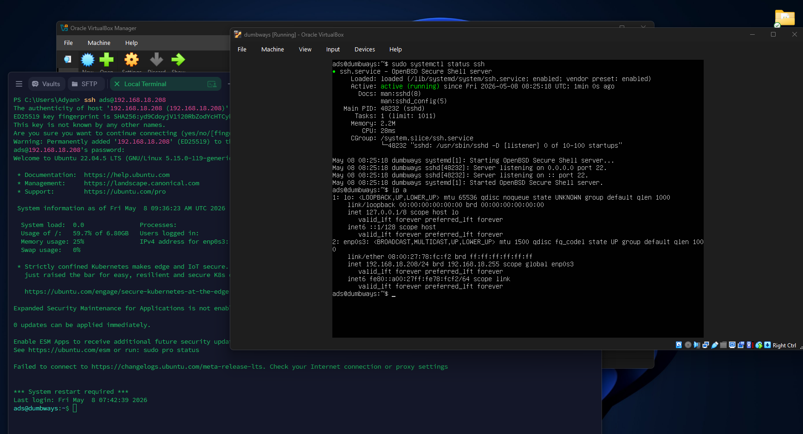

---

### 2. SSH Login dengan Public Key Authentication

Setup SSH key-based authentication untuk keamanan lebih baik:

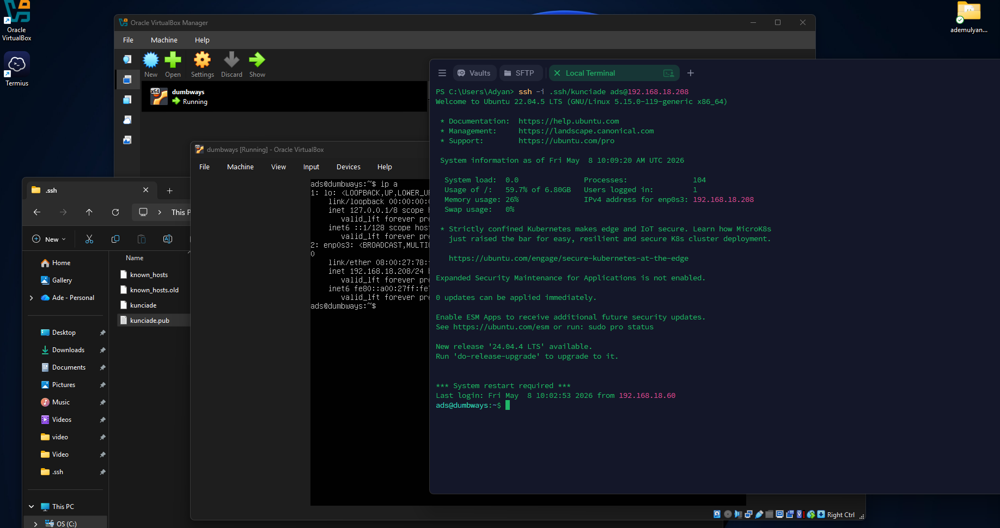

**Keuntungan Public Key Authentication:**
- ✅ Lebih aman dari password
- ✅ Tidak perlu input password setiap login
- ✅ Mencegah brute force attack

---

### 3. Text Manipulation Commands

#### `cat` - Display File Contents

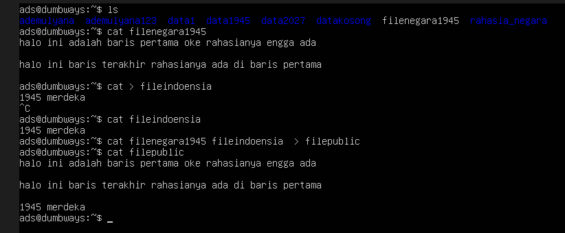

---

#### `sed` - Stream Editor

Manipulasi teks menggunakan sed:

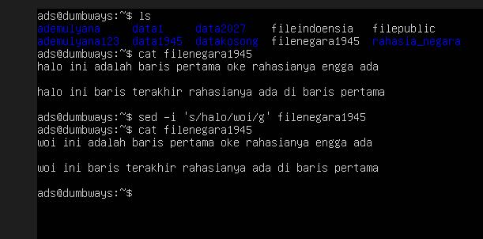

---

#### `grep` - Pattern Search

Mencari pattern dalam file:

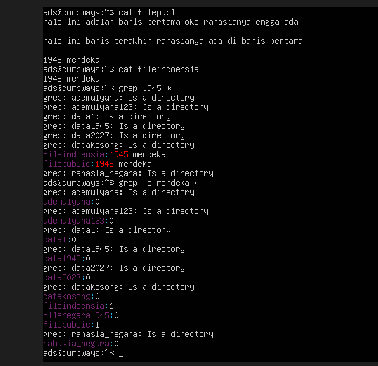

---

#### `sort` - Sort Lines

Mengurutkan isi file:

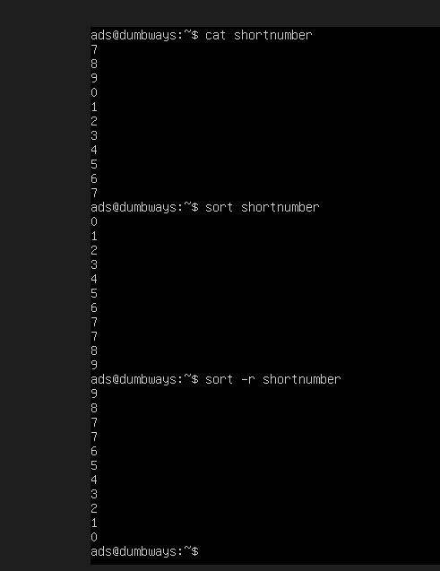

---

#### `echo` - Display Text

Menampilkan teks atau variable:

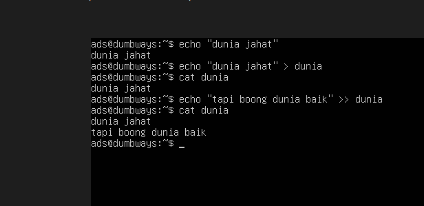

---

### 4. UFW (Uncomplicated Firewall) Configuration

**Mengizinkan koneksi ke port baru:**

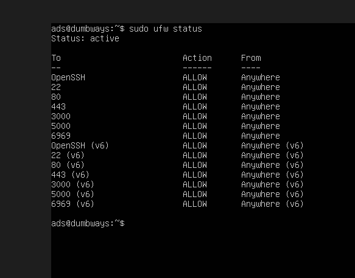

**Common UFW Commands:**

```bash
sudo ufw status                  # Cek status firewall
sudo ufw enable                  # Enable firewall
sudo ufw disable                 # Disable firewall
sudo ufw allow 22                # Allow SSH
sudo ufw allow 80                # Allow HTTP
sudo ufw allow 443               # Allow HTTPS
sudo ufw allow [port_number]     # Allow custom port
```

---

## Day 4: Git & GitHub Basics

### 1. Konfigurasi GitHub

Setup username dan email untuk Git:

```bash
git config --global user.name "githubusername"
git config --global user.email "email@github.com"
```

---

### 2. Setup SSH Key untuk GitHub

#### Generate SSH Key:

```bash
ssh-keygen
```

**Langkah selanjutnya:**
1. Copy isi file `.pub` (public key)
2. Buka GitHub → Settings → SSH and GPG Keys
3. Klik "New SSH Key"
4. Paste public key dan save

---

### 3. Test Koneksi SSH ke GitHub

Verifikasi koneksi SSH:

```bash
ssh -T git@github.com
```

**Jika muncul pertanyaan:**
```
Are you sure you want to continue connecting (yes/no)?
```

**Ketik:** `yes`

**Hasil SSH berhasil:**


---

### 4. Membuat Repository Local

#### Setup Project Folder:

```bash
mkdir namafolder          # Buat folder project
cd namafolder            # Masuk ke folder
git init                 # Inisialisasi Git repository
```

---

### 5. Git Workflow Commands

#### Melihat Status:

```bash
git status
```

---

#### Menambahkan File ke Stage:

```bash
git add namafile         # Add specific file
git add .                # Add all files
```

---

#### Commit Perubahan:

```bash
git commit -m "first commit"
```

---

#### Membatalkan Perubahan:

```bash
git restore namafile
```

---

### 6. Git Branch Management

#### Branch Commands:

```bash
git branch                    # Lihat branch aktif
git branch namabranch         # Buat branch baru
git checkout namabranch       # Pindah branch
```

---

### 7. Push ke GitHub

Upload perubahan ke remote repository:

```bash
git push origin namabranch
```

**Contoh:**
```bash
git push origin main
```

**Hasil Push berhasil:**


---

### 8. Pull dari GitHub

Ambil update terbaru dari remote:

```bash
git pull origin master
# atau
git pull origin main
```

---

## Day 5: Application Deployment

### 1. Frontend Deployment dengan Node.js

#### Deploy dengan Node.js v12.x.x:

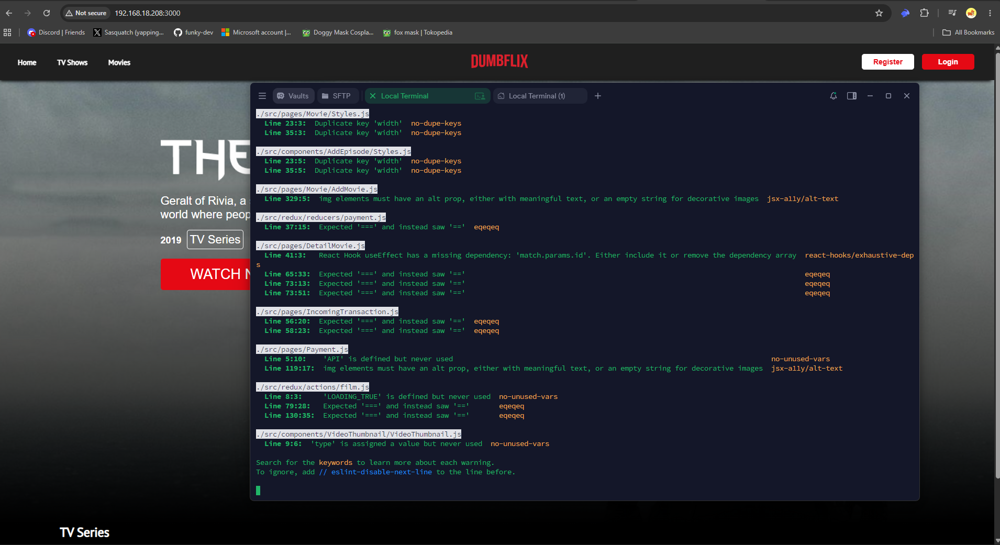

---

#### Deploy dengan Node.js v10.x.x:

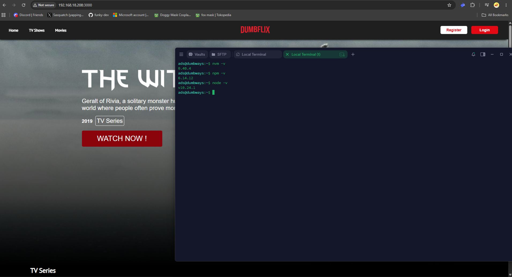

**Note:** Aplikasi berhasil running di kedua versi Node.js

---

### 2. Python Application Deployment

Deploy aplikasi Python:

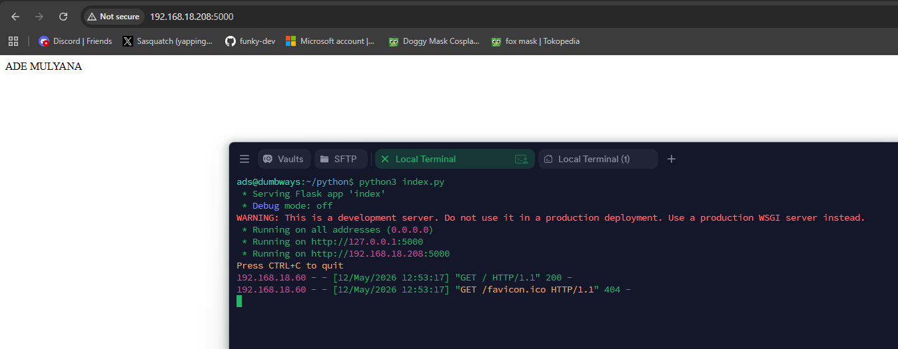

✅ Aplikasi Python berhasil running

---

### 3. Golang Application Deployment

Deploy aplikasi Golang:

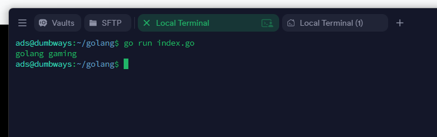

✅ Aplikasi Golang berhasil running

---

**Summary Deployment:**
- ✅ Node.js (v10 & v12) - Success
- ✅ Python - Success
- ✅ Golang - Success

---

## Day 6: Reverse Proxy with Nginx

### 1. Reverse Proxy Concept

**Diagram Reverse Proxy Architecture:**

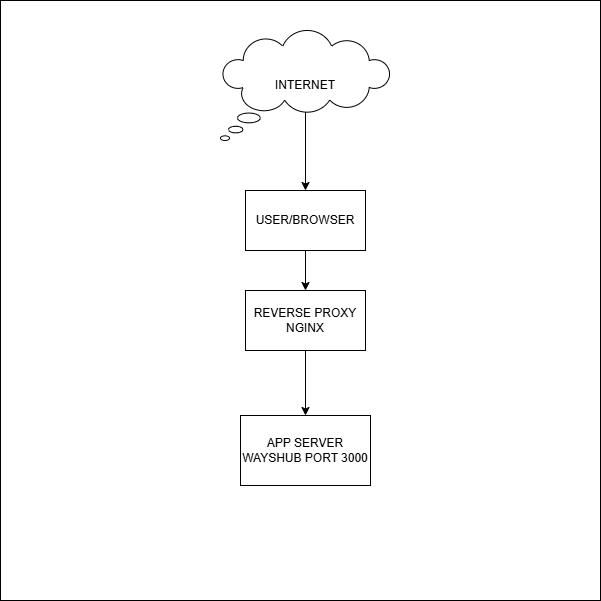

**Fungsi Reverse Proxy:**
- Menerima request dari client
- Meneruskan request ke backend server
- Mengembalikan response ke client
- Load balancing
- SSL/TLS termination
- Caching

---

### 2. Deploy dengan Custom Domain

#### Edit Windows Hosts File:

Lokasi file: `C:\Windows\System32\drivers\etc\hosts`

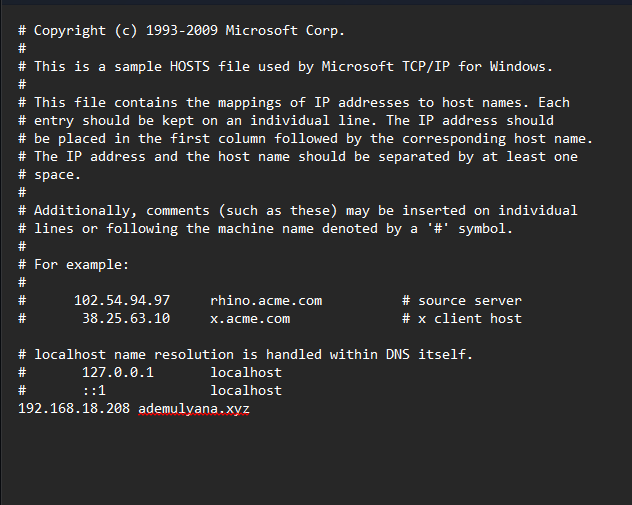

**Tambahkan mapping:**
```
192.168.x.x    domain1.local
192.168.x.x    domain2.local
```

---

### 3. Nginx Configuration Results

#### Default Nginx Page:

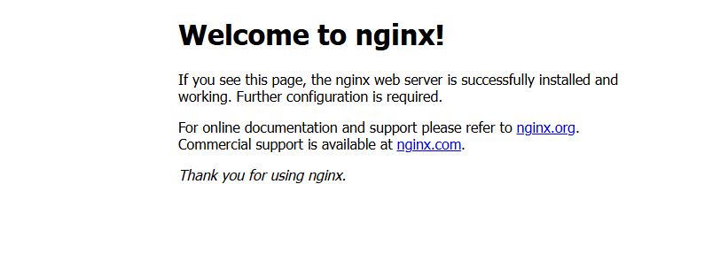

---

#### Deploy dengan Domain Custom:

Aplikasi berhasil diakses menggunakan custom domain:

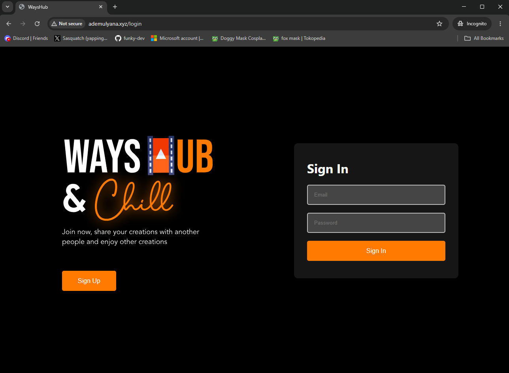

**Aplikasi yang berhasil di-deploy:**
- ✅ Frontend dengan custom domain
- ✅ Backend dengan custom domain
- ✅ Reverse proxy berfungsi dengan baik

---

## Summary & Key Takeaways

### What We've Learned:

#### Day 1: Foundation
- ✅ DevOps concepts & responsibilities
- ✅ Ubuntu Server installation & configuration
- ✅ Network setup & testing

#### Day 2: Linux Fundamentals
- ✅ Network design & IP addressing
- ✅ Shell basics (SH vs BASH)
- ✅ Essential Linux commands

#### Day 3: Security & Text Processing
- ✅ SSH authentication (password & key-based)
- ✅ Text manipulation tools
- ✅ Firewall configuration

#### Day 4: Version Control
- ✅ Git & GitHub setup
- ✅ SSH key authentication
- ✅ Git workflow & commands

#### Day 5: Application Deployment
- ✅ Multi-language deployment (Node.js, Python, Golang)
- ✅ Version management
- ✅ Application running & testing

#### Day 6: Web Server & Proxy
- ✅ Nginx reverse proxy
- ✅ Custom domain configuration
- ✅ Multi-application hosting

---

## Next Steps

**Areas for Further Learning:**
1. Docker & Containerization
2. CI/CD Pipeline
3. Kubernetes & Orchestration
4. Monitoring & Logging (Prometheus, Grafana)
5. Infrastructure as Code (Terraform, Ansible)
6. Cloud Platforms (AWS, GCP, Azure)

---

## Resources & References

- Ubuntu Server Documentation
- Nginx Official Docs
- Git Documentation
- Linux Command Line Resources

---

**End of Presentation**

*Prepared for DevOps Training Program*