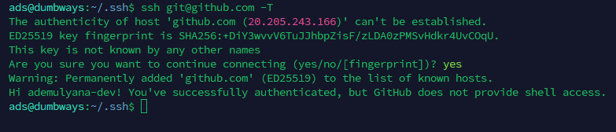
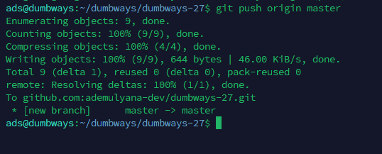

# Git & GitHub Basic

## 1. Konfigurasi GitHub

Sebelum menggunakan Git, lakukan konfigurasi username dan email GitHub terlebih dahulu.

```bash
git config --global user.name "githubusername"
git config --global user.email "emailgithub.com"
```

---

## 2. Setup SSH Key

Generate SSH Key:

```bash
ssh-keygen
```

Lalu copy isi file `.pub` dan tambahkan ke akun GitHub pada menu:

- Settings
- SSH and GPG Keys
- New SSH Key

---

## 3. Test Koneksi SSH ke GitHub

Gunakan perintah berikut untuk memastikan SSH berhasil terhubung:

```bash
ssh -T git@github.com
```

Jika muncul pertanyaan:

```bash
Are you sure you want to continue connecting (yes/no)?
```

Ketik:

```bash
yes
```

---

## 4. Membuat Repository Local

Membuat folder project:

```bash
mkdir namafolder
```

Masuk ke folder project:

```bash
cd namafolder
```

Inisialisasi Git:

```bash
git init
```

---

## 5. Melihat Status Repository

Untuk melihat status perubahan file:

```bash
git status
```

---

## 6. Menambahkan File ke Stage

Menambahkan satu file:

```bash
git add namafile
```

Menambahkan semua file:

```bash
git add .
```

---

## 7. Commit Perubahan

Jika perubahan sudah siap disimpan:

```bash
git commit -m "first commit"
```

---

## 8. Membatalkan Perubahan

Untuk membatalkan perubahan pada file:

```bash
git restore namafile
```

---

## 9. Branch Git

Melihat branch aktif:

```bash
git branch
```

Membuat branch baru:

```bash
git branch namabranch
```

Pindah branch:

```bash
git checkout namabranch
```

---

## 10. Push ke GitHub

Push branch ke GitHub:

```bash
git push origin namabranch
```

Contoh:

```bash
git push origin main
```

---

## 11. Pull Perubahan dari Remote

Mengambil update terbaru dari repository remote:

```bash
git pull origin master
```

atau

```bash
git pull origin main
```

---

## Hasil SSH Berhasil Terhubung



---

## Hasil Push Berhasil

