# Week 1 Notes - Database Deployment on AWS

## Overview
- The app server is used to deploy the database.
- The gateway is used for communication between the frontend and backend.
- The project uses AWS as the cloud platform.

## 1. Prepare the server
- Use one server only for this setup.
- Make sure the server is ready and accessible.

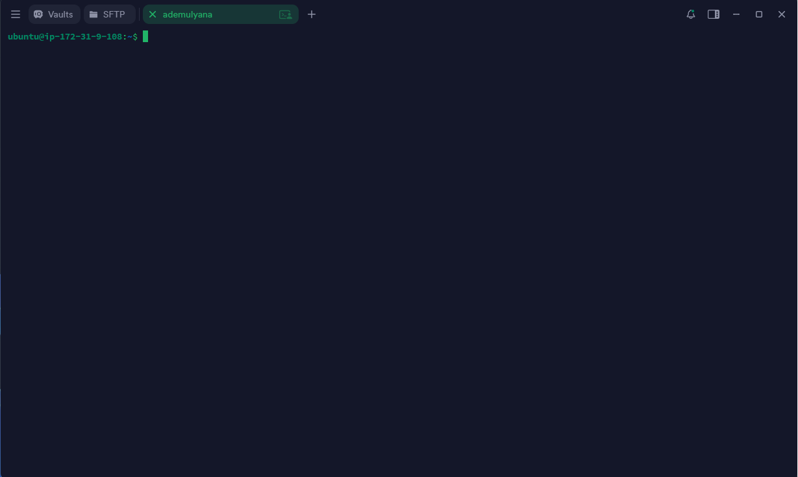

## 2. Install MySQL
- Install MySQL on the server.
- Make sure the installation process completes successfully.

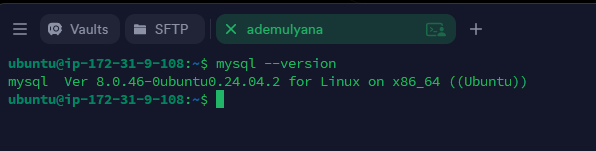

## 3. Secure MySQL installation
- Run the secure installation process.
- Set a strong password for the root user.
- Follow the recommended security steps.

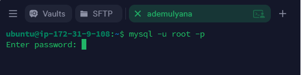

## 4. Create a user
- Create a new database user for the application.
- Use a username and password that are appropriate for the project.

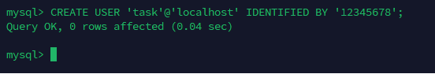

## 5. Create a new database
- Create a database that will be used by the application.
- Confirm that the database name is correct.

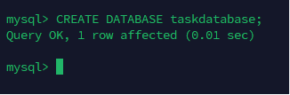

## 6. Grant privileges
- Give the new user access to the database that was created.
- This allows the application to connect and use the database.

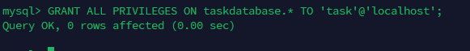

## 7. Configure MySQL bind address
- Edit the MySQL configuration file:
  `/etc/mysql/mysql.conf.d/mysqld.cnf`
- Change the bind address if needed so the database can be accessed properly.

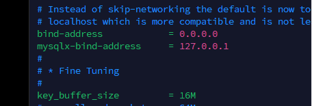

## 8. Role-based access control (RBAC)
- Create a new database named `demo`.
- Create a table named `transaction` with sample data.
- Create two roles:
  - `admin`
  - `guest`
- Grant the following permissions:
  - `admin`: `SELECT`, `INSERT`, `UPDATE`, and `DELETE` on the `transaction` table
  - `guest`: only `SELECT` on the `transaction` table
- Create users and assign them to the roles:
  - one user for the admin role
  - one user for the guest role
- Test all users to confirm the access permissions.

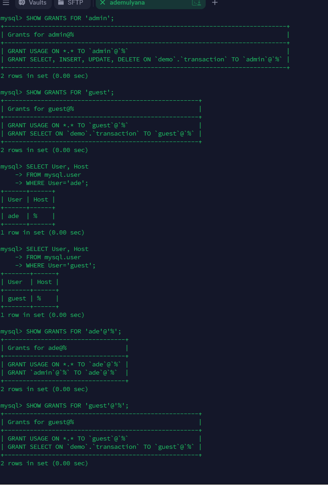

## 9. Remote database access from local computer
- Try to access the database remotely using `mysql-client` from your local machine.
- Make sure the server allows remote connections.

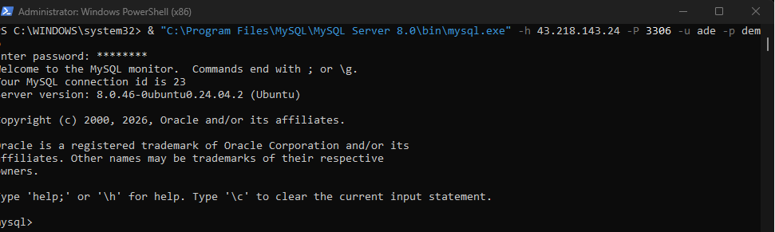

## 10. Deploy backend with PM2
- Deploy the backend application using PM2.
- Make sure the application runs in the background and restarts automatically if needed.

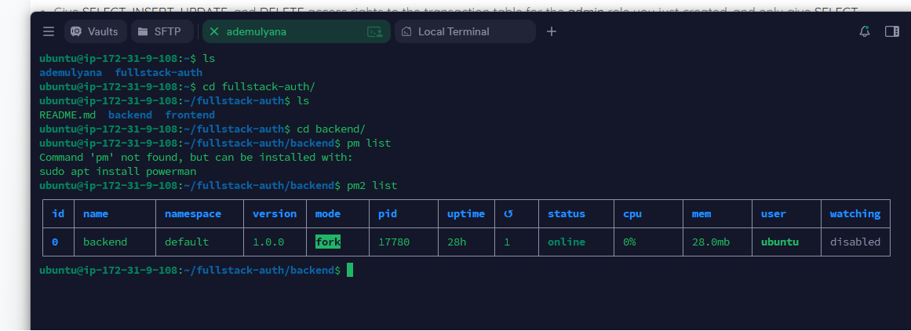

## 11. Deploy frontend
- Deploy the frontend application.
- Verify that the application is accessible after deployment.

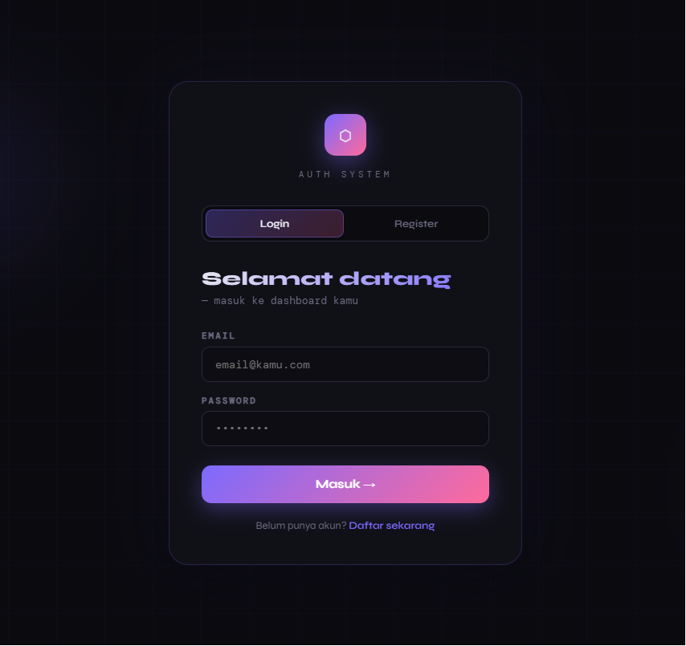

