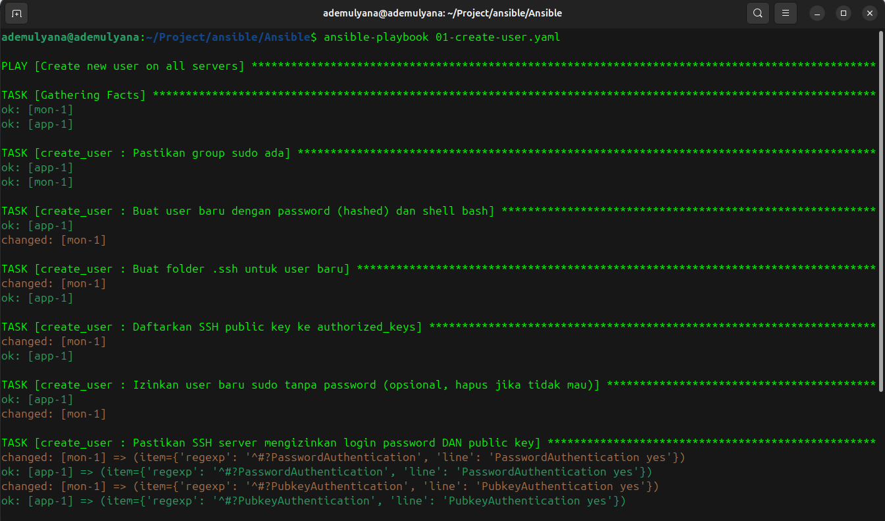
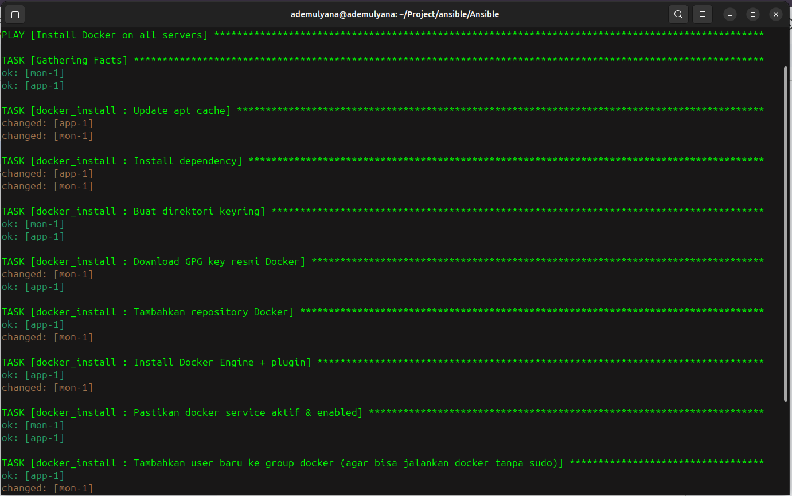
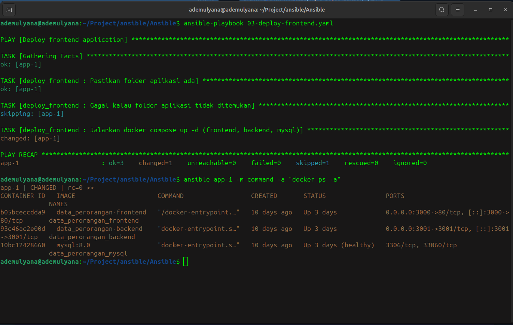
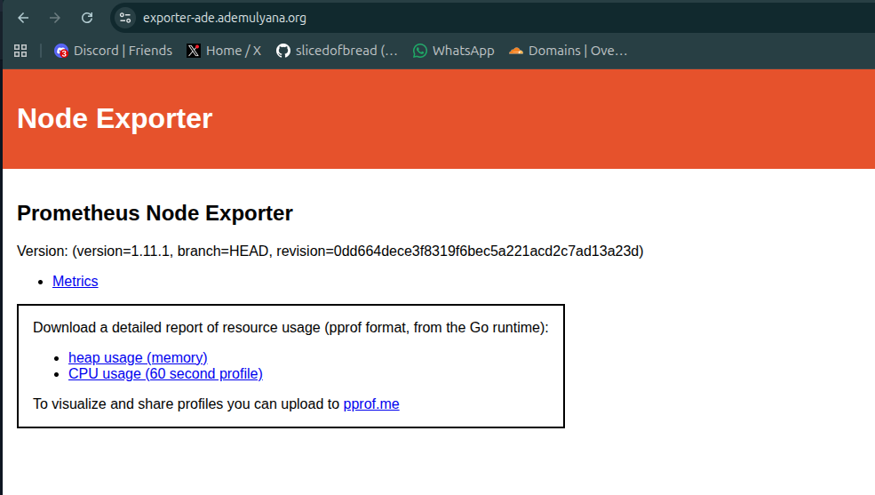
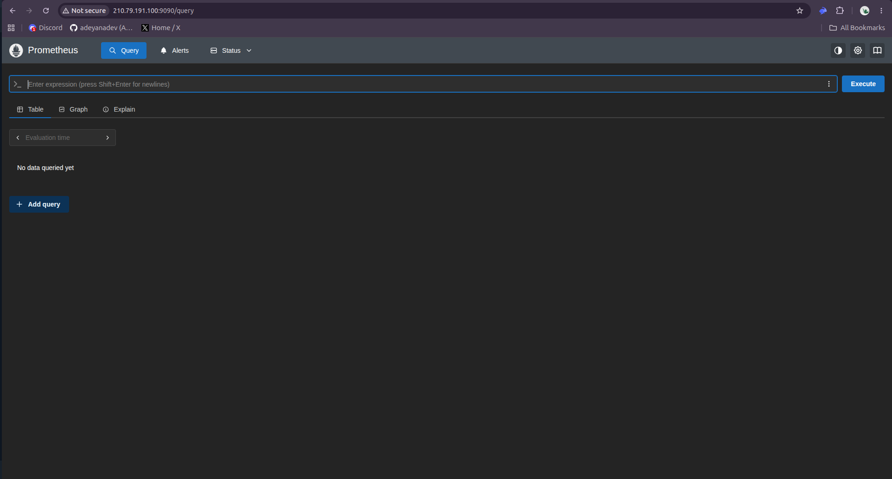
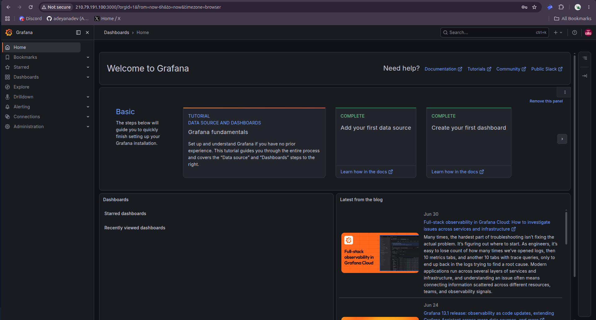
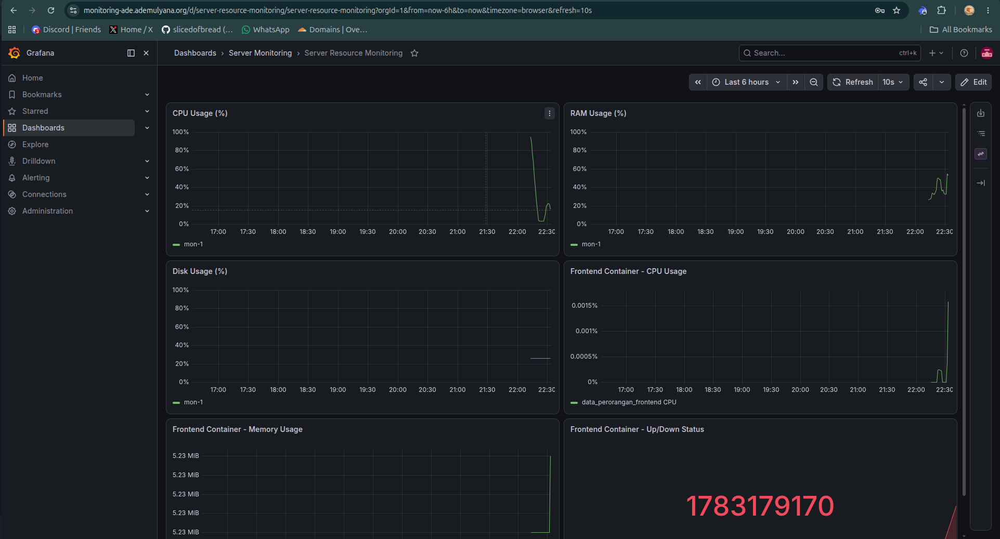
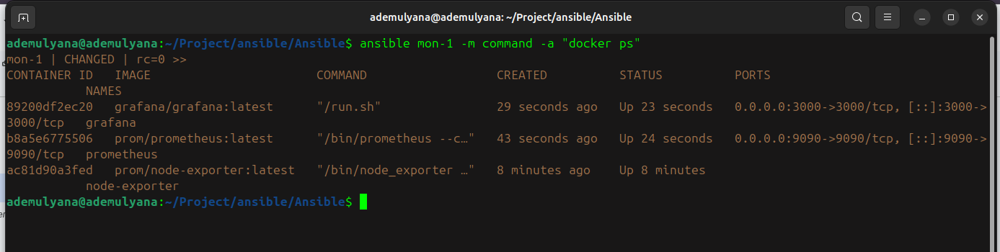
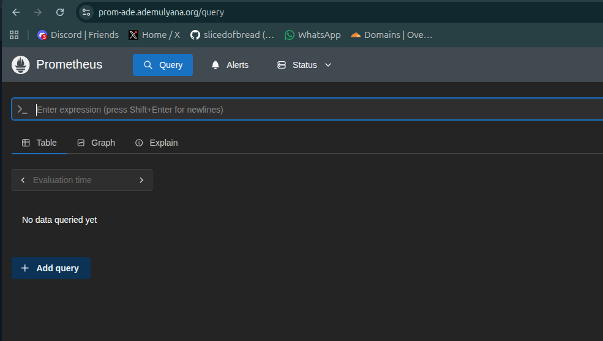
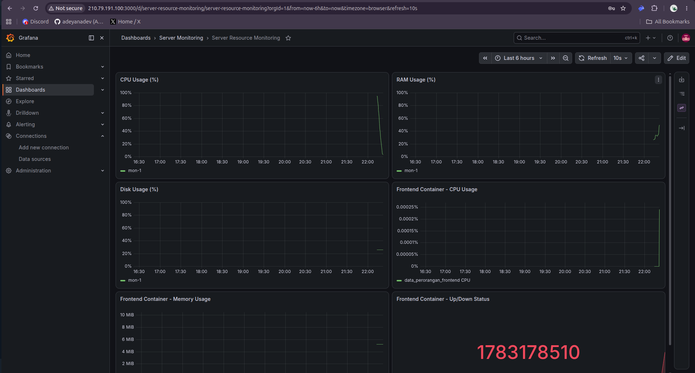

# TUGAS AUTOMATION: ANSIBLE, DOCKER, MONITORING & SSL

## 1. Membuat User Baru (SSH Key + Password)
Buatlah user baru menggunakan Ansible dengan login menggunakan SSH key dan password.

---

## 2. Instalasi Docker
Instalasi Docker dan Docker Compose Plugin di semua server menggunakan Ansible.

---

## 3. Deploy Frontend Application
Deploy aplikasi frontend yang sudah digunakan sebelumnya menggunakan Ansible dengan Docker container.

---

## 4. Instalasi Node Exporter
Setup Node Exporter di semua server untuk monitoring metrics (CPU, Memory, Disk, Network).

---

## 5. Setup Prometheus
Konfigurasi Prometheus untuk scraping metrics dari Node Exporter, Docker container, dan aplikasi frontend.

---

## 6. Setup Grafana
Instalasi Grafana dengan datasource Prometheus dan persiapan untuk membuat dashboard monitoring.

---

## 7. Setup Nginx Reverse Proxy
Konfigurasi Nginx sebagai reverse proxy untuk 3 service:
- `prom-yourname.studentdumbways.my.id` → Prometheus (port 9090)
- `monitoring-yourname.studentdumbways.my.id` → Grafana (port 3000)
- `exporter-yourname.studentdumbways.my.id` → Node Exporter (port 9100)

---

## 8. Generate SSL Certificate
Generate SSL certificate menggunakan Certbot (Let's Encrypt) untuk semua domain monitoring.

---

## 9. PromQL Queries (Rumus Monitoring)
Dokumentasi rumus PromQL yang digunakan untuk monitoring:
- CPU Usage > 20%
- Memory Usage > 75%
- Disk Usage
- Container Status
- Uptime monitoring

---

## 10. Grafana Dashboard
Membuat dashboard Grafana untuk monitoring resource server:
- CPU Usage gauge
- Memory Usage gauge
- Disk Usage gauge
- Container Status table
- 24-hour trend graph

---

## 11. Monitoring Specific Container
Setup monitoring khusus untuk container aplikasi frontend dengan metrics tracking.

